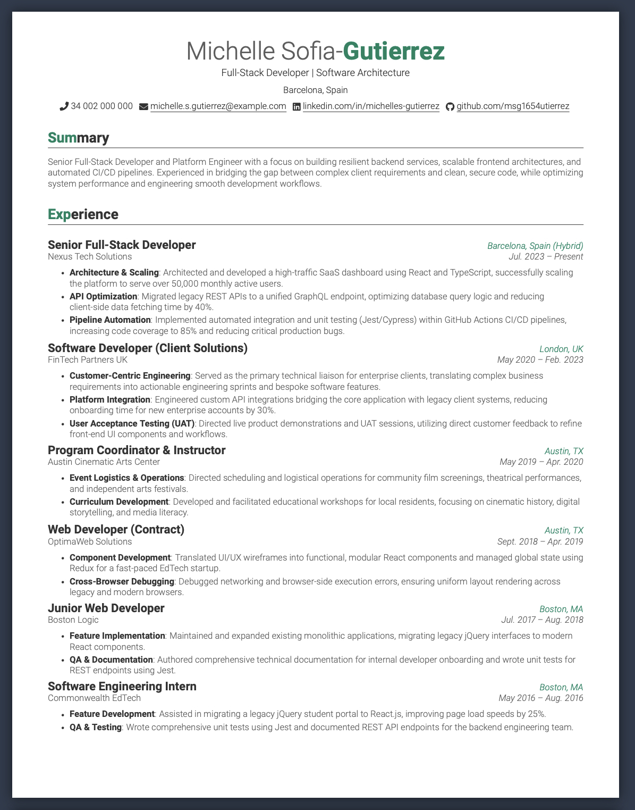
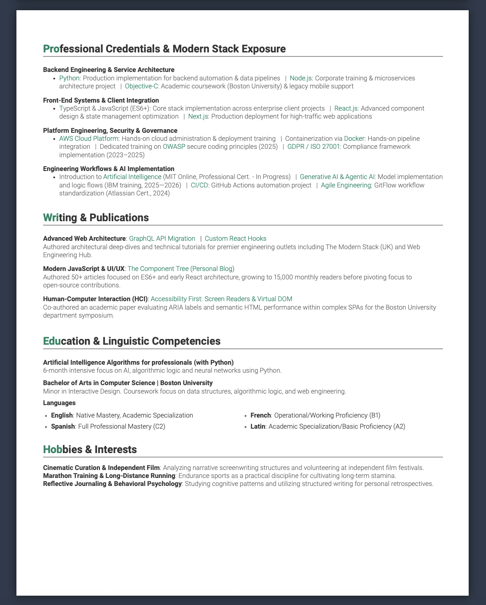
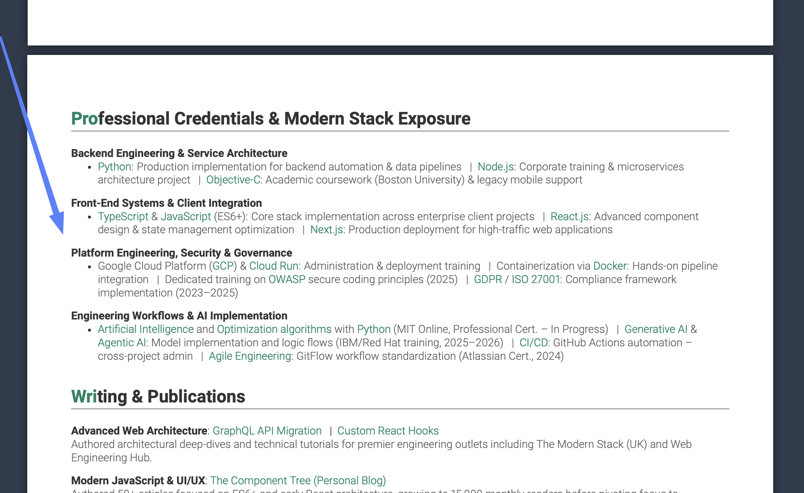

## About 

Given that modern recruiting relies heavily on Applicant Tracking Systems to parse, index, and categorize candidates data, this resume is a high-density, highly searchable piece made for senior software developers and/or engineers.

I named this template Strata (the Latin plural of stratum, meaning "layers"). I believe a professional identity is not a static list; it is a narrative built from stacked experiences—education, projects, professional history, and personal initiatives. Most resume templates are category-intensive, forcing expertise into rigid, predefined boxes. Strata is built as a flexible foundation, allowing the story of your expertise to define the structure, not the other way around.

  
  

## Characteristics

* **Single-file implementation:** It is entirely built in LaTeX, in one document, eliminating the hustle of juggling the complex branching logic of various files.
* **Context-driven persona:** This is a dense resume for senior professionals, meaning the resume is context-based and focuses on defining a persona rather than looking at individual, isolated categories (how traditionally we would look at skills, education, experience, etc.).
* **Redefining the Skills category:** The document implements various advanced categories, like publications, and the "Professional Credentials & Modern Stack Exposure"—I thought of this category to work as a display for professional certifications and as a **visual** keyword matching space. This is meant to completely replace the traditional skills section that usually looks like a marginal category, a boring list of items either separated by a comma or listed with bullet points.

  

*Mini-disclaimer: ATS-screening tools normally do 2 specific tasks when reading and categorizing a resume:*

*1. Firstly, they take a resume and do a global parsing for keywords; in this case, the Strata template plays fantastically because it is dense in text and specific words.*
*2. Secondly, ATS systems will generally do some sort of categorization, meaning they will look for intuitive category names like "Experience" and "Education" to try to take the information and place it into a specific field of the database when creating the candidate profile. Worst-case scenario, this category information will be distributed to the "Others" category.*

*Finally, a recruiter checks the resume and sees the keywords popping up and the context clearly displayed.*
  
* **Dual optimization:** Moreover, I tried to make the document optimal and clean-looking from both the code and the rendering perspective (design-wise).
* **Machine readability:** The generated PDF is machine-readable and should read nicely on various viewers; it introduces a standardized dictionary into the binary file to force a 1:1 character match.
* **Typography and aesthetics:** It uses a well-known design with strict typography implementations and warm colors. I personally always loved the disruptive elements found in the Awesome-Resume, but give that is it one file and has a custom LaTeX code for alignment, it is easier to edit, operate with, and has simplicity by design.
